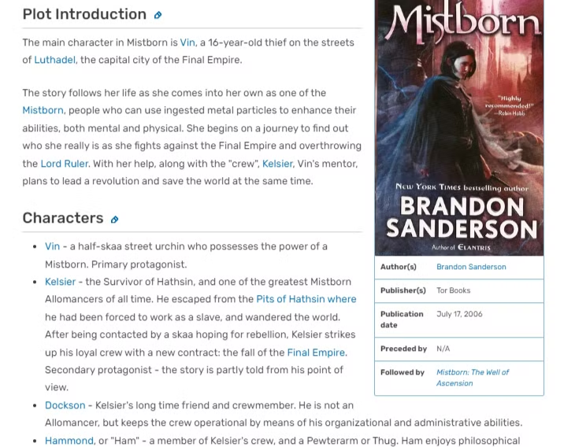
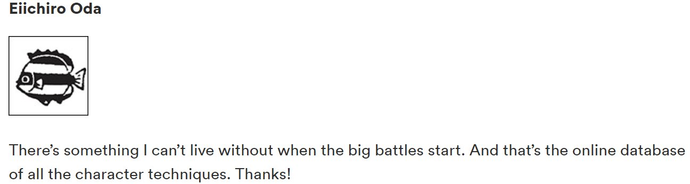

# WikiWeave

# Overview

WikiWeave is the first open-source tool for automatically extracting and organizing narrative data from book series into a comprehensive, wiki-style knowledge base using LLM agents. It allows fans and authors to create a wiki-style encyclopedia from the source material alone. 

[Video Demo](https://www.loom.com/share/84fb5f2d391945478702a0799acb64af?sid=76571282-c51f-4b54-92e7-af4d04038708)

## What's a Wiki?



Fandom wikis are community-driven online encyclopedias for books, TV shows, movies, and other media. These platforms enable fans to create, edit, and manage content about their favourite topics. They offer detailed information such as character biographies, plot summaries, and trivia.

These wikis are useful not only to the fans but also to the authors. Here is a quote by the author of One Piece, the best-selling comic author of all time, with 500 million copies in global sales.



From the Weekly Shonen Jump 36/37 Issue

# Usage

WikiWeave uses LLM agents to carefully read through a series while simultaneously filling out a custom wiki design.  It takes both the source material and wiki schema as inputs. 

1. Add all books in the series to `input_docs`.  Use the following namespace convention for clarity -
    
    ```
    {SeriesName} - Book {BookNumber} - {BookName}
    ```
    
2. Define the wiki structure that you want, the overall schema. 
    
    ```yaml
    Wiki
    ├── Characters
    │   └── CharacterName
    │       ├── Personality
    │       ├── Aliases
    │       ├── Appearance
    │       └── Trivia
    └── Settings
        └── SettingName
            ├── Description
            ├── Characters Involved
            └── Trivia
    ```
    

> For instance, if you're creating a wiki for the 'Harry Potter' series, your `input_docs` would include all seven books named accordingly. Your schema might include sections for 'Spells', 'Potions', 'Magical Creatures', etc.
> 

And that's it! Sit back and enjoy as WikiWeave creates your wiki in real-time. 

# Technical Details

WikiWeave employs a hierarchical class structure to mirror the organization of a wiki. The `Wiki` class is the foundation, containing `Sections` like 'Characters' or 'Settings'. Each `Section` contains `Entities` (e.g., individual characters), which have `Attributes` like 'Personality' or 'Appearance'.

```
Wiki
└── Section
    └── SectionEntity
        └── EntityAttributes: list[Attribute]
				      ├── data
				      └── buffer            
```

## Wiki

The outline of the structure of the `Wiki` class and its associated fields and functions --

```yaml
Wiki
├── Fields:
│   ├── sections
│   ├── docstore
│   ├── running_summary
│   ├── add_model
│   └── update_model
├── Functions:
│   ├── read_chunks
│   ├── update_sections
│   ├── save_wiki
│   └── load_wiki
```

- It uses 2 LLM Agents
    - `add_model` — Used to add relevant data from the source material to the `buffer` of any `SectionEntity`’s `Attribute`.
    - `update_model` —  It combines existing content from a `SectionEntity.Attribute`.`data` and new content from its `buffer` and rewrite it back into `data`.
- The `docstore` reads from `input_docs`, extracts text data and divides the books into digestible chunks of text roughly 2000 words long.
- The `running_summary` keeps track of the plot, ongoing events, characters present, and settings to provide context for the LLM agent as it processes each chunk.

## Abstract Classes

### Section

Every abstract class defined here inherits from `pydantic.BaseModel`, allowing us to use the `section_functions` to get structured output in the form of function calls.

```yaml
Section (Abstract Class)
├── Fields:
│   ├── name
│   └── entities
├── Properties:
│   └── section_functions

Characters (Subclass)
├── Fields:
│   ├── name
│   └── entities
├── Functions:
│   ├── add_character
│   ├── add_to_character_personality
│   ├── add_to_character_trivia
│   ├── add_to_character_aliases
│   ├── add_to_character_appearance
├── Properties:
│   └── section_functions
```

### SectionEntity

```yaml
SectionEntity (Abstract Class)
├── Fields:
│   ├── name
│   └── attributes
```

### EntityAttributes

```yaml
EntityAttributes (Abstract Class)
├── Functions:
│   └── get_attributes

CharacterAttributes (Subclass)
├── Fields:
│   ├── personality
│   ├── aliases
│   ├── trivia
│   └── appearance
├── Functions:
│   └── get_attributes

```

### Attribute

```yaml
Attribute (Abstract Class)
├── Fields:
│   ├── name
│   ├── type
│   ├── description
│   ├── default
│   ├── update_every_n_insertions
│   ├── data
│   └── buffer
├── Functions:
│   ├── add_to_buffer
│   ├── update_data
│   ├── to_markdown (abstract)
│   └── from_markdown (abstract)
```

# Upcoming Features

- [ ]  **Alias-Based Merging Functionality**: *This will allow the system to recognize and merge entities that are referred to by different names, reducing duplicates and improving data accuracy.*
- [ ]  **Add more section examples:** *Offering examples and best practices for structuring these sections to help users design their wikis effectively.*
- [ ]  **RAG-Based Index for Wiki Content**: *Incorporating Retrieval-Augmented Generation (RAG) will enhance the relevance of generated content by referencing existing wiki data during generation.*
- [ ]  **Allow Multi-Turn LLM Function Calls with RAG Retrieval for Section Functions**: *Enabling multi-turn function calls with RAG retrieval will improve the LLM's ability to generate more accurate and context-aware content.*
- [ ]  **Add OpenAI models**
